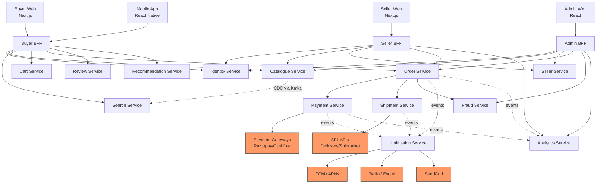

# Technical Architecture Document
## ShopNow E-Commerce Platform

**Version:** 1.0  
**Status:** Approved  
**Owner:** Engineering Architecture Team  
**Last Updated:** 2026-05-29  
**Related:** [PRD.md](./PRD.md)

---

## Table of Contents

1. [Architecture Overview](#1-architecture-overview)
2. [Architecture Decision Records (ADRs)](#2-architecture-decision-records-adrs)
3. [System Decomposition — Microservices](#3-system-decomposition--microservices)
4. [Data Architecture](#4-data-architecture)
5. [API Design & Gateway](#5-api-design--gateway)
6. [Frontend Architecture](#6-frontend-architecture)
7. [Event-Driven Architecture](#7-event-driven-architecture)
8. [Security Architecture](#8-security-architecture)
9. [Infrastructure & Deployment](#9-infrastructure--deployment)
10. [Observability & Reliability](#10-observability--reliability)
11. [Performance & Scalability](#11-performance--scalability)
12. [Disaster Recovery & Business Continuity](#12-disaster-recovery--business-continuity)
13. [Development Workflow & Standards](#13-development-workflow--standards)
14. [Capacity Planning](#14-capacity-planning)
15. [Dependency Map](#15-dependency-map)

---

## 1. Architecture Overview

### 1.1 Guiding Principles

| Principle | Description |
|-----------|-------------|
| **Domain Isolation** | Each bounded context owns its data; no shared databases across services |
| **API-First** | All capabilities exposed as versioned APIs; UI is just another consumer |
| **Async by Default** | Prefer event-driven communication; synchronous calls only when response is needed immediately |
| **Fail Fast, Recover Faster** | Circuit breakers, graceful degradation, automated recovery over manual intervention |
| **Observability as a Feature** | Tracing, metrics, and structured logs built in from day one, not bolted on |
| **Security in Depth** | Multiple independent security layers; no single point of trust |
| **Evolutionary Architecture** | Prefer reversible decisions; avoid premature optimisation; extract services only when justified |

### 1.2 High-Level Architecture

```
┌─────────────────────────────────────────────────────────────────────────┐
│                            CLIENT LAYER                                  │
│  ┌──────────────┐  ┌──────────────┐  ┌──────────────┐  ┌────────────┐  │
│  │  Web App     │  │ Mobile App   │  │  Seller PWA  │  │ Admin SPA  │  │
│  │  (Next.js)   │  │(React Native)│  │  (Next.js)   │  │  (React)   │  │
│  └──────┬───────┘  └──────┬───────┘  └──────┬───────┘  └─────┬──────┘  │
└─────────┼────────────────┼────────────────┼─────────────────┼──────────┘
          │                │                │                  │
┌─────────▼────────────────▼────────────────▼──────────────────▼──────────┐
│                      CDN / WAF / DDoS Protection                         │
│                   (Cloudflare Enterprise or AWS Shield)                  │
└──────────────────────────────────┬──────────────────────────────────────┘
                                   │
┌──────────────────────────────────▼──────────────────────────────────────┐
│                           API GATEWAY LAYER                              │
│  ┌────────────────────────────────────────────────────────────────────┐  │
│  │  Kong / AWS API Gateway                                            │  │
│  │  • JWT Validation    • Rate Limiting    • Request Routing          │  │
│  │  • TLS Termination   • CORS             • API Versioning           │  │
│  └────────────────────────────────────────────────────────────────────┘  │
│  ┌─────────────────┐  ┌─────────────────┐  ┌────────────────────────┐   │
│  │  Buyer BFF      │  │  Seller BFF     │  │  Admin BFF             │   │
│  │  (Node/Fastify) │  │  (Node/Fastify) │  │  (Node/Fastify)        │   │
│  └────────┬────────┘  └────────┬────────┘  └───────────┬────────────┘   │
└───────────┼────────────────────┼───────────────────────┼───────────────┘
            │                    │                        │
┌───────────▼────────────────────▼────────────────────────▼───────────────┐
│                       SERVICE MESH (Istio / Linkerd)                     │
│                  mTLS • Traffic Policies • Observability                  │
│                                                                           │
│  ┌─────────────┐ ┌─────────────┐ ┌─────────────┐ ┌─────────────────┐   │
│  │   Identity  │ │  Catalogue  │ │   Search    │ │  Cart & Wishlist │  │
│  │   Service   │ │   Service   │ │   Service   │ │    Service       │  │
│  └─────────────┘ └─────────────┘ └─────────────┘ └─────────────────┘   │
│  ┌─────────────┐ ┌─────────────┐ ┌─────────────┐ ┌─────────────────┐   │
│  │   Order     │ │  Payment    │ │  Shipment   │ │  Notification    │  │
│  │   Service   │ │   Service   │ │   Service   │ │    Service       │  │
│  └─────────────┘ └─────────────┘ └─────────────┘ └─────────────────┘   │
│  ┌─────────────┐ ┌─────────────┐ ┌─────────────┐ ┌─────────────────┐   │
│  │   Review    │ │   Seller    │ │  Promotion  │ │   Fraud          │  │
│  │   Service   │ │   Service   │ │   Service   │ │   Service        │  │
│  └─────────────┘ └─────────────┘ └─────────────┘ └─────────────────┘   │
│  ┌─────────────┐ ┌─────────────┐                                        │
│  │  Analytics  │ │  Recommend  │                                        │
│  │   Service   │ │   Service   │                                        │
│  └─────────────┘ └─────────────┘                                        │
└──────────────────────────────────┬──────────────────────────────────────┘
                                   │
┌──────────────────────────────────▼──────────────────────────────────────┐
│                         EVENT BUS (Apache Kafka)                         │
│             Topics • Partitioning • Consumer Groups • Replay             │
└──────────────────────────────────┬──────────────────────────────────────┘
                                   │
┌──────────────────────────────────▼──────────────────────────────────────┐
│                            DATA LAYER                                    │
│  ┌──────────────┐ ┌──────────────┐ ┌──────────────┐ ┌───────────────┐  │
│  │  PostgreSQL  │ │    Redis     │ │ OpenSearch   │ │   ClickHouse  │  │
│  │  (per svc)   │ │  (shared)    │ │  (search)    │ │  (analytics)  │  │
│  └──────────────┘ └──────────────┘ └──────────────┘ └───────────────┘  │
│  ┌──────────────┐ ┌──────────────┐                                      │
│  │  AWS S3      │ │  Kafka Log   │                                      │
│  │ (media/CDN)  │ │  Compaction  │                                      │
│  └──────────────┘ └──────────────┘                                      │
└─────────────────────────────────────────────────────────────────────────┘
```

### 1.3 Architecture Style: Modular Microservices

We adopt **microservices** with **Domain-Driven Design (DDD)** bounded contexts. Each service:

- Has a single business domain responsibility
- Owns its own database (polyglot persistence)
- Communicates asynchronously via Kafka events where possible
- Exposes a versioned REST or gRPC API for synchronous needs
- Deploys independently on Kubernetes

**Why not a monolith?**  
Multiple independent teams (Catalogue, Payments, Fulfilment, Seller Growth), widely differing scale requirements (Search vs Admin), and a need for independent deployments (payment changes must not block UI releases) justify microservices from day one. See ADR-001.

---

## 2. Architecture Decision Records (ADRs)

### ADR-001: Microservices over Modular Monolith

| Field | Value |
|-------|-------|
| **Status** | Accepted |
| **Date** | 2026-04-01 |
| **Deciders** | CTO, Engineering Leads |

**Context:**  
Team of 25+ engineers split across 5 product squads. Each squad needs independent release cycles. Search, Payments, and Catalogue have dramatically different scaling profiles.

**Decision:**  
Adopt microservices with a per-service database. Start with 12 core services, extract more only as team/load justifies.

**Consequences:**  
- (+) Independent deployments per squad  
- (+) Fine-grained scaling  
- (–) Higher operational complexity; mitigated with Kubernetes + service mesh  
- (–) Distributed transactions; mitigated with Saga pattern

---

### ADR-002: PostgreSQL as Default Transactional Store

| Field | Value |
|-------|-------|
| **Status** | Accepted |
| **Date** | 2026-04-02 |

**Context:**  
Need ACID transactions for Orders and Payments. Team has strong SQL expertise.

**Decision:**  
PostgreSQL 16 as the default per-service RDBMS. Exceptions: Redis (caching/sessions), OpenSearch (search), ClickHouse (OLAP).

**Consequences:**  
- (+) Strong consistency guarantees  
- (+) Rich indexing, JSONB for flexible attributes  
- (+) Proven at scale with read replicas and PgBouncer pooling  
- (–) Vertical scaling ceiling; mitigated with sharding plan at 100M+ rows

---

### ADR-003: Apache Kafka for Event Bus

| Field | Value |
|-------|-------|
| **Status** | Accepted |
| **Date** | 2026-04-03 |

**Context:**  
Need durable, replayable event stream for order lifecycle, inventory updates, and analytics pipeline. Estimated 50K events/sec at peak.

**Decision:**  
Apache Kafka (managed via Confluent Cloud or AWS MSK) as the primary event bus.

**Consequences:**  
- (+) Durable log; consumers can replay from any offset  
- (+) High throughput; proven at 1M+ messages/sec  
- (+) Schema registry (Avro) enforces contract between producers/consumers  
- (–) Operationally heavier than SQS/SNS; justified by replay and throughput needs

---

### ADR-004: Saga Pattern for Distributed Transactions

| Field | Value |
|-------|-------|
| **Status** | Accepted |
| **Date** | 2026-04-04 |

**Context:**  
Placing an order spans Order Service → Payment Service → Inventory Service → Notification Service. 2-phase commit is not viable across microservices.

**Decision:**  
**Choreography-based Saga** for simple flows (order placement). **Orchestration-based Saga** (via Temporal.io) for complex flows with compensating transactions (return + refund).

**Consequences:**  
- (+) No single point of failure  
- (+) Temporal provides durable execution with automatic retries  
- (–) Eventual consistency; UX must handle "processing" states gracefully

---

### ADR-005: Backend For Frontend (BFF) Pattern

| Field | Value |
|-------|-------|
| **Status** | Accepted |
| **Date** | 2026-04-05 |

**Context:**  
Buyer web, mobile app, seller portal, and admin panel have very different data shape needs. A single generic API causes over-fetching (web) or under-fetching (mobile).

**Decision:**  
Three separate BFF services: Buyer BFF, Seller BFF, Admin BFF. Each aggregates calls from downstream services and shapes the response for its client.

**Consequences:**  
- (+) Optimised payloads per client  
- (+) Client teams can evolve their BFF independently  
- (–) Code duplication risk; mitigated with shared internal SDK

---

### ADR-006: OpenSearch for Product Search

| Field | Value |
|-------|-------|
| **Status** | Accepted |
| **Date** | 2026-04-06 |

**Context:**  
Need sub-300ms search across 10M+ products with faceted filters, typo tolerance, and personalisation hooks.

**Decision:**  
OpenSearch 2.x (AWS managed). Custom BM25 scoring + scripted field boosting for seller rating and sales velocity. Blue/green index strategy for zero-downtime re-indexing.

**Consequences:**  
- (+) Proven at catalogue scale; AWS managed reduces ops burden  
- (+) k-NN plugin available for future vector/semantic search  
- (–) Index drift from DB requires sync pipeline; handled by Kafka consumer

---

### ADR-007: Feature Flags via Unleash

| Field | Value |
|-------|-------|
| **Status** | Accepted |
| **Date** | 2026-04-07 |

**Decision:**  
Self-hosted Unleash for feature flag management. All new features gated behind flags enabling canary releases, A/B tests, and instant kill-switches.

---

### ADR-008: Temporal.io for Workflow Orchestration

| Field | Value |
|-------|-------|
| **Status** | Accepted |
| **Date** | 2026-04-08 |

**Decision:**  
Temporal.io for long-running, stateful workflows: order fulfilment saga, return + refund saga, seller KYC pipeline. Provides durable execution with automatic retries, timeouts, and compensating transactions.

---

## 3. System Decomposition — Microservices

### 3.1 Service Catalogue

| Service | Language | Database | Responsibility |
|---------|----------|----------|---------------|
| **Identity Service** | Node.js / Fastify | PostgreSQL + Redis | Registration, login, OTP, JWT, OAuth2, sessions |
| **Catalogue Service** | Node.js / Fastify | PostgreSQL + S3 | Product CRUD, variant management, category tree, image storage |
| **Search Service** | Python / FastAPI | OpenSearch | Full-text search, facets, autocomplete, index sync |
| **Cart Service** | Node.js / Fastify | Redis (primary) + PostgreSQL (persist) | Cart lifecycle, coupon validation, price recalculation |
| **Order Service** | Node.js / Fastify | PostgreSQL | Order placement, status machine, invoice generation |
| **Payment Service** | Node.js / Fastify | PostgreSQL | Payment intent, gateway orchestration, reconciliation, refunds |
| **Shipment Service** | Node.js / Fastify | PostgreSQL | 3PL integration, tracking, label generation, delivery events |
| **Seller Service** | Node.js / Fastify | PostgreSQL | Seller onboarding, KYC, inventory, payout management |
| **Review Service** | Node.js / Fastify | PostgreSQL | Review CRUD, moderation queue, rating aggregation |
| **Promotion Service** | Node.js / Fastify | PostgreSQL + Redis | Coupon/discount rules, flash sales, validation engine |
| **Notification Service** | Node.js / Fastify | PostgreSQL (audit) | Email, SMS, push via Kafka consumers |
| **Fraud Service** | Python / FastAPI | PostgreSQL + Redis | Rule engine + ML scoring for fraud detection |
| **Analytics Service** | Python / FastAPI | ClickHouse | Event ingestion, dashboards, seller reports |
| **Recommendation Service** | Python / FastAPI | Redis + PostgreSQL | Collaborative filtering, item2vec, personalised feeds |

### 3.2 Service Communication Matrix

```
                  │ Identity │ Catalogue │ Search │ Cart │ Order │ Payment │ Shipment │ Seller │ Fraud │
──────────────────┼──────────┼───────────┼────────┼──────┼───────┼─────────┼──────────┼────────┼───────┤
Identity          │          │           │        │      │  JWT  │   JWT   │          │  JWT   │       │
Catalogue         │          │           │  sync  │ sync │       │         │          │  sync  │       │
Cart              │          │   sync    │        │      │  sync │         │          │        │       │
Order             │          │           │        │  →   │       │  sync   │  event   │        │ sync  │
Payment           │          │           │        │      │ event │         │          │        │ sync  │
Seller            │  sync    │   sync    │        │      │ event │  event  │  event   │        │       │
Notification      │          │           │        │      │ event │  event  │  event   │  event │       │

Legend: sync = synchronous REST/gRPC call, event = Kafka event, → = triggers
```

### 3.3 Identity Service — Detail

**Responsibilities:** User registration, OTP auth, Google/Apple OAuth, JWT issuance, session management, RBAC

**API Contracts:**
```
POST   /v1/auth/register          → { userId, accessToken, refreshToken }
POST   /v1/auth/login/otp/request → { requestId }
POST   /v1/auth/login/otp/verify  → { accessToken, refreshToken }
POST   /v1/auth/oauth/google      → { accessToken, refreshToken }
POST   /v1/auth/token/refresh     → { accessToken }
DELETE /v1/auth/sessions/:id      → 204
GET    /v1/users/me               → UserProfile
```

**JWT Strategy:**
- Access token: RS256, 15-minute TTL, signed with rotating private key
- Refresh token: opaque UUID, 7-day TTL, stored in Redis with user binding
- Key rotation: new key pair every 90 days; old key retained for 15 minutes to drain in-flight tokens
- JWKS endpoint published for downstream service validation (no shared secret)

**State diagram — User Session:**
```
[Anonymous] ──register/login──► [Active]
     │                             │
     └──guest checkout──► [Guest]  │──suspend──► [Suspended]
                              │    │
                              └────► [Active] (on account creation)
```

### 3.4 Order Service — Detail

**Order State Machine:**

```
         ┌─────────────────────────────────────────────┐
         │                                             │
  [PENDING_PAYMENT]                                   │
         │                                             │
   payment_success                              cancel (before SHIPPED)
         │                                             │
   [CONFIRMED] ──── cancel ──────────────────► [CANCELLED]
         │
   seller_accepts
         │
   [PROCESSING]
         │
   seller_dispatches
         │
   [SHIPPED]
         │
   3pl_delivered
         │
   [DELIVERED] ──── return_requested ──► [RETURN_INITIATED]
         │                                      │
         │                              pickup_complete
         │                                      │
         │                              [RETURN_IN_TRANSIT]
         │                                      │
         │                              qc_passed / qc_failed
         │                                      │
         └──────────────────────────────► [REFUND_INITIATED] ──► [CLOSED]
```

**Saga — Order Placement (Choreography):**

```
Order Service                Kafka                  Downstream
     │                        │                         │
     │──── ORDER_PLACED ──────►│                         │
     │                        │──── ORDER_PLACED ───────►│ Payment Service
     │                        │◄─── PAYMENT_SUCCESS ─────│
     │◄──── PAYMENT_SUCCESS ──│                         │
     │──── ORDER_CONFIRMED ───►│                         │
     │                        │──── ORDER_CONFIRMED ────►│ Inventory Service
     │                        │◄─── STOCK_RESERVED ──────│
     │                        │──── STOCK_RESERVED ─────►│ Shipment Service
     │                        │──── ORDER_CONFIRMED ────►│ Notification Svc
     │                        │                         │
     │  (on PAYMENT_FAILED)   │                         │
     │──── ORDER_CANCELLED ───►│ (compensating event)   │
```

### 3.5 Payment Service — Detail

**Payment State Machine:**

```
[INITIATED] → [PENDING] → [SUCCESS] → [SETTLED]
                  │              └──── [REFUND_PENDING] → [REFUNDED]
                  └──── [FAILED]
                  └──── [TIMEOUT] → retry → [PENDING] or [FAILED]
```

**Gateway Orchestration:**

```javascript
// Pseudo-code: payment routing with fallback
async function processPayment(intent: PaymentIntent) {
  const gateways = selectGateways(intent.method); // [Razorpay, Cashfree, PayU]
  for (const gateway of gateways) {
    try {
      const result = await gateway.charge(intent);
      if (result.success) return result;
    } catch (err) {
      if (err.type === 'GATEWAY_DOWN') continue; // try next
      throw err; // hard failures don't retry
    }
  }
  throw new AllGatewaysFailedError();
}
```

**Idempotency:** Every payment request carries an `idempotency_key` (UUID v4). The Payment Service stores key → result in Redis (24-hr TTL). Duplicate requests return the cached result without re-charging.

---

## 4. Data Architecture

### 4.1 Database per Service

Each microservice owns its schema. Cross-service data needs are fulfilled by:
1. **Synchronous API call** — when real-time data is needed (e.g., cart price check)
2. **Event-driven projection** — service maintains a read-optimised local copy updated via Kafka (e.g., Order Service stores seller_name snapshot at order time)

```
┌─────────────────┐     ┌─────────────────┐     ┌─────────────────┐
│  Identity DB    │     │  Catalogue DB   │     │   Order DB      │
│  (PostgreSQL)   │     │  (PostgreSQL)   │     │  (PostgreSQL)   │
│                 │     │                 │     │                 │
│  users          │     │  categories     │     │  orders         │
│  sessions       │     │  products       │     │  order_items    │
│  addresses      │     │  variants       │     │  order_events   │
│  oauth_accounts │     │  product_images │     │  invoices       │
└─────────────────┘     └─────────────────┘     └─────────────────┘

┌─────────────────┐     ┌─────────────────┐     ┌─────────────────┐
│  Payment DB     │     │  Seller DB      │     │  Shipment DB    │
│  (PostgreSQL)   │     │  (PostgreSQL)   │     │  (PostgreSQL)   │
│                 │     │                 │     │                 │
│  payment_intents│     │  sellers        │     │  shipments      │
│  payments       │     │  kyc_documents  │     │  tracking_events│
│  refunds        │     │  inventory      │     │  3pl_webhooks   │
│  reconciliation │     │  payouts        │     │                 │
└─────────────────┘     └─────────────────┘     └─────────────────┘

┌─────────────────┐     ┌─────────────────────────────────────────┐
│   Cart Store    │     │          Search Index                    │
│    (Redis)      │     │         (OpenSearch)                     │
│                 │     │                                          │
│  cart:{userId}  │     │  products index (10M+ docs)              │
│  price_cache    │     │  synonyms / stopwords                    │
│  coupon_locks   │     │  personalisation signals                 │
└─────────────────┘     └─────────────────────────────────────────┘
```

### 4.2 Catalogue Database Schema (Core Tables)

```sql
-- Category hierarchy (adjacency list + materialised path for performance)
CREATE TABLE categories (
    id          UUID PRIMARY KEY DEFAULT gen_random_uuid(),
    parent_id   UUID REFERENCES categories(id),
    name        VARCHAR(100) NOT NULL,
    slug        VARCHAR(120) UNIQUE NOT NULL,
    path        LTREE NOT NULL,          -- e.g. "electronics.mobiles.smartphones"
    level       SMALLINT NOT NULL,
    attributes_schema JSONB,             -- dynamic attribute definitions per category
    is_active   BOOLEAN DEFAULT TRUE,
    created_at  TIMESTAMPTZ DEFAULT NOW()
);
CREATE INDEX idx_categories_path ON categories USING GIST(path);

-- Product master
CREATE TABLE products (
    id          UUID PRIMARY KEY DEFAULT gen_random_uuid(),
    seller_id   UUID NOT NULL,
    category_id UUID NOT NULL REFERENCES categories(id),
    brand       VARCHAR(100),
    title       VARCHAR(500) NOT NULL,
    description TEXT,
    status      VARCHAR(20) CHECK (status IN ('draft','active','inactive','deleted')),
    created_at  TIMESTAMPTZ DEFAULT NOW(),
    updated_at  TIMESTAMPTZ DEFAULT NOW()
);
CREATE INDEX idx_products_seller_id   ON products(seller_id);
CREATE INDEX idx_products_category_id ON products(category_id);
CREATE INDEX idx_products_status      ON products(status);

-- Product variants (size, colour, storage, etc.)
CREATE TABLE product_variants (
    id              UUID PRIMARY KEY DEFAULT gen_random_uuid(),
    product_id      UUID NOT NULL REFERENCES products(id) ON DELETE CASCADE,
    sku             VARCHAR(100) UNIQUE NOT NULL,
    price           NUMERIC(12,2) NOT NULL,
    mrp             NUMERIC(12,2),
    stock_qty       INTEGER NOT NULL DEFAULT 0,
    attributes      JSONB,               -- { "colour": "Red", "size": "XL" }
    is_active       BOOLEAN DEFAULT TRUE,
    created_at      TIMESTAMPTZ DEFAULT NOW()
);
CREATE INDEX idx_variants_product_id ON product_variants(product_id);
CREATE INDEX idx_variants_sku        ON product_variants(sku);
CREATE INDEX idx_variants_attributes ON product_variants USING GIN(attributes);
```

### 4.3 Order Database Schema

```sql
CREATE TABLE orders (
    id              UUID PRIMARY KEY DEFAULT gen_random_uuid(),
    user_id         UUID NOT NULL,
    status          VARCHAR(30) NOT NULL,
    subtotal        NUMERIC(12,2) NOT NULL,
    discount_amount NUMERIC(12,2) DEFAULT 0,
    tax_amount      NUMERIC(12,2) DEFAULT 0,
    shipping_amount NUMERIC(12,2) DEFAULT 0,
    total_amount    NUMERIC(12,2) NOT NULL,
    payment_status  VARCHAR(20) NOT NULL,
    shipping_address JSONB NOT NULL,   -- snapshot at order time
    created_at      TIMESTAMPTZ DEFAULT NOW(),
    updated_at      TIMESTAMPTZ DEFAULT NOW()
);

CREATE TABLE order_items (
    id              UUID PRIMARY KEY DEFAULT gen_random_uuid(),
    order_id        UUID NOT NULL REFERENCES orders(id),
    variant_id      UUID NOT NULL,
    seller_id       UUID NOT NULL,
    product_title   VARCHAR(500) NOT NULL,   -- snapshot
    variant_attrs   JSONB,                   -- snapshot
    qty             INTEGER NOT NULL,
    unit_price      NUMERIC(12,2) NOT NULL,
    tax_rate        NUMERIC(5,2),
    item_status     VARCHAR(30) NOT NULL,
    created_at      TIMESTAMPTZ DEFAULT NOW()
);

-- Append-only event log for full audit trail
CREATE TABLE order_events (
    id          BIGSERIAL PRIMARY KEY,
    order_id    UUID NOT NULL REFERENCES orders(id),
    event_type  VARCHAR(50) NOT NULL,
    payload     JSONB,
    actor_id    UUID,
    actor_type  VARCHAR(20),
    created_at  TIMESTAMPTZ DEFAULT NOW()
);
CREATE INDEX idx_order_events_order_id ON order_events(order_id, created_at DESC);
```

### 4.4 Caching Strategy

```
┌────────────────────────────────────────────────────────────────────┐
│                        Redis Cluster                                │
│                                                                    │
│  Namespace             TTL         Eviction      Purpose           │
│  ─────────────────── ─────────── ──────────── ──────────────────  │
│  session:{token}       7 days      LRU          Auth sessions      │
│  cart:{userId}         30 days     LRU          Persistent cart    │
│  product:{variantId}   10 min      LRU          PDP cache          │
│  category_tree         1 hour      manual       Nav menu           │
│  price:{variantId}     5 min       LRU          Price consistency  │
│  rate_limit:{ip}       1 min       TTL          API rate limits    │
│  coupon:{code}         match expiry TTL         Coupon validity    │
│  fraud_score:{userId}  15 min      TTL          Risk scores        │
│  otp:{mobile}          10 min      TTL          OTP verification   │
└────────────────────────────────────────────────────────────────────┘
```

**Cache Invalidation Patterns:**
- **Write-through:** Product price updates → write DB + invalidate Redis simultaneously
- **Event-driven invalidation:** `PRODUCT_UPDATED` Kafka event → Catalogue consumers purge affected keys
- **TTL-based:** Session, OTP, rate-limit keys self-expire
- **Tag-based invalidation:** Products tagged by `seller_id`; seller account suspension purges all their cached products

### 4.5 Search Index Sync Pipeline

```
PostgreSQL (Catalogue DB)
        │
        │ Debezium CDC (Change Data Capture)
        ▼
Apache Kafka  ←──── topic: catalogue.product.events
        │
        │ Kafka Connect (OpenSearch Sink Connector)
        ▼
OpenSearch Index
        │
        │ Blue/green swap on full re-index
        ▼
Active Search Alias: "products_live"
```

**Sync Latency SLA:** < 30 seconds from DB write to searchable in OpenSearch  
**Full Re-index:** Nightly at 02:00 UTC on the inactive index; alias swap after validation

### 4.6 Analytics Data Pipeline

```
Application Events (all services)
        │
        │ Kafka topic: analytics.events (schema: Avro)
        ▼
Apache Flink (stream processing)
    • Sessionisation
    • Funnel computation
    • Fraud signal aggregation
        │
        ├──► ClickHouse (OLAP) ──► Seller Analytics Dashboards
        │                       ──► Admin Business Intelligence
        │
        └──► Feature Store (Redis) ──► ML Models (Recommendations, Fraud)
```

---

## 5. API Design & Gateway

### 5.1 API Gateway Configuration

```yaml
# Kong declarative config excerpt
services:
  - name: buyer-bff
    url: http://buyer-bff:3000
    plugins:
      - name: jwt
        config:
          key_claim_name: kid
          claims_to_verify: [exp, iat]
      - name: rate-limiting
        config:
          minute: 300
          hour: 5000
          policy: redis
      - name: request-id
      - name: correlation-id
      - name: response-transformer
        config:
          add:
            headers: ["X-Content-Type-Options:nosniff", "X-Frame-Options:DENY"]
```

### 5.2 REST API Conventions

```
Base URL:       https://api.shopnow.in/v1
Authentication: Authorization: Bearer <accessToken>
Content-Type:   application/json
Pagination:     Cursor-based: ?cursor=<base64_token>&limit=20&direction=next
Filtering:      ?price_min=500&price_max=5000&brand=Nike&rating_min=4
Sorting:        ?sort=price:asc,rating:desc
Partial Update: PATCH with JSON Merge Patch (RFC 7396)
```

**Error Response Format (RFC 7807):**
```json
{
  "type": "https://api.shopnow.in/errors/payment-failed",
  "title": "Payment Processing Failed",
  "status": 402,
  "detail": "The card was declined by the issuing bank.",
  "instance": "/orders/abc-123/payment",
  "trace_id": "01HV3X2M8P9Q",
  "errors": [
    { "field": "card.number", "code": "CARD_DECLINED", "message": "Insufficient funds" }
  ]
}
```

**Standard HTTP Status Codes:**

| Code | Scenario |
|------|---------|
| 200 | Successful GET / PATCH |
| 201 | Resource created (POST) |
| 204 | Successful DELETE |
| 400 | Validation error |
| 401 | Missing or invalid token |
| 403 | Insufficient permissions (RBAC) |
| 404 | Resource not found |
| 409 | Conflict (duplicate, stale version) |
| 422 | Business rule violation |
| 429 | Rate limit exceeded |
| 503 | Downstream service unavailable |

### 5.3 BFF Aggregation Pattern

```javascript
// Buyer BFF — Product Detail Page aggregation
async function getProductDetailPage(variantId: string, userId?: string) {
  const [variant, reviews, recommendations, wishlistStatus] = await Promise.allSettled([
    catalogueService.getVariant(variantId),
    reviewService.getSummary(variantId),
    userId ? recommendService.getSimilar(variantId, userId) : Promise.resolve([]),
    userId ? wishlistService.check(variantId, userId) : Promise.resolve(false),
  ]);

  return {
    product: fulfilled(variant),
    reviews: fulfilled(reviews),
    recommendations: fulfilled(recommendations) ?? [],
    isWishlisted: fulfilled(wishlistStatus) ?? false,
    // Partial responses degrade gracefully; page still renders without recommendations
  };
}
```

### 5.4 Internal gRPC Services

High-frequency synchronous inter-service calls use gRPC for lower overhead:

```protobuf
// catalogue.proto
service CatalogueService {
  rpc GetVariant       (GetVariantRequest)       returns (Variant);
  rpc GetVariantBatch  (GetVariantBatchRequest)  returns (VariantList);
  rpc CheckStock       (CheckStockRequest)        returns (StockStatus);
  rpc ReserveStock     (ReserveStockRequest)      returns (ReservationResult);
}

// pricing.proto
service PricingService {
  rpc GetEffectivePrice (PriceRequest)  returns (PriceResponse);
  rpc ValidateCoupon    (CouponRequest) returns (CouponResult);
}
```

---

## 6. Frontend Architecture

### 6.1 Buyer Web App (Next.js 14)

```
src/
├── app/                          # Next.js App Router
│   ├── (buyer)/                  # Buyer route group
│   │   ├── page.tsx              # Homepage
│   │   ├── search/page.tsx       # PLP
│   │   ├── product/[id]/page.tsx # PDP
│   │   ├── cart/page.tsx
│   │   └── checkout/
│   │       ├── address/page.tsx
│   │       ├── payment/page.tsx
│   │       └── confirm/page.tsx
│   ├── (account)/
│   │   ├── orders/page.tsx
│   │   └── profile/page.tsx
│   └── api/                      # API routes (BFF proxies)
├── components/
│   ├── ui/                       # Primitive components (Button, Input, Modal)
│   ├── product/                  # ProductCard, ProductGallery, PriceDisplay
│   ├── cart/                     # CartDrawer, CartItem
│   ├── checkout/                 # AddressForm, PaymentForm
│   └── layout/                   # Header, Footer, Sidebar
├── lib/
│   ├── api/                      # API client (typed fetch wrappers)
│   ├── hooks/                    # useCart, useAuth, useSearch
│   ├── store/                    # Zustand global state (cart, auth)
│   └── utils/
└── types/                        # Shared TypeScript types
```

**Rendering Strategy:**

| Page | Strategy | Reason |
|------|---------|--------|
| Homepage | ISR (60s revalidation) | Near-static, personalised widgets hydrated client-side |
| Category/Search PLP | SSR | SEO critical + dynamic filters |
| Product Detail (PDP) | ISR (30s) + client hydration | SEO + real-time price/stock |
| Cart | CSR | No SEO; always user-specific |
| Checkout | CSR | Sensitive; must not cache |
| Order Confirmation | CSR | Per-user, post-purchase |
| Account / Orders | CSR | Private, no SEO value |

**State Management:**
- **Zustand** for client-side state: cart (optimistic updates), auth, UI state
- **React Query (TanStack)** for server state: products, orders, reviews — with stale-while-revalidate
- **No Redux** — overkill; Zustand + React Query covers 100% of use cases

### 6.2 Component Library

Built on **Radix UI Primitives** + **Tailwind CSS** with a custom design token system:

```typescript
// Design tokens (tailwind.config.ts)
colors: {
  primary:   { DEFAULT: '#FF6B00', hover: '#E55F00', light: '#FFF0E5' }, // ShopNow orange
  secondary: { DEFAULT: '#2B2D42', light: '#4A4E69' },
  success:   '#22C55E',
  danger:    '#EF4444',
  warning:   '#F59E0B',
}
```

### 6.3 Mobile App (React Native / Expo)

```
src/
├── app/                          # Expo Router file-based routing
│   ├── (tabs)/
│   │   ├── index.tsx             # Home
│   │   ├── search.tsx            # Search
│   │   ├── cart.tsx              # Cart
│   │   └── account.tsx           # Profile
│   ├── product/[id].tsx          # PDP
│   └── checkout/
├── components/                   # Shared RN components
├── hooks/                        # Native-specific hooks
└── services/                     # API clients
```

**Mobile-specific features:**
- Offline cart (AsyncStorage + sync on reconnect)
- Biometric auth (Expo LocalAuthentication)
- Push notifications (Expo Notifications + FCM/APNs)
- Deep linking (product://product/123, shopnow://order/456)
- Image lazy-loading with Expo Image (progressive WebP)

---

## 7. Event-Driven Architecture

### 7.1 Kafka Topic Design

```
Naming convention: {domain}.{entity}.{event_type}

Topics:
  identity.user.registered
  identity.user.deactivated

  catalogue.product.created
  catalogue.product.updated
  catalogue.product.deleted
  catalogue.inventory.updated

  order.order.placed
  order.order.confirmed
  order.order.cancelled
  order.order.delivered

  payment.payment.initiated
  payment.payment.succeeded
  payment.payment.failed
  payment.refund.initiated
  payment.refund.completed

  shipment.shipment.created
  shipment.shipment.shipped
  shipment.shipment.out_for_delivery
  shipment.shipment.delivered

  review.review.submitted
  review.review.approved
  review.review.rejected

  analytics.event.raw           ← all domain events fan-out here
```

**Partition Strategy:**

| Topic | Partition Key | Partition Count | Reason |
|-------|-------------|----------------|--------|
| order.order.* | order_id | 24 | Ensure all order events for same order are ordered |
| payment.payment.* | payment_id | 12 | Payment sequence ordering |
| catalogue.product.* | product_id | 48 | High throughput; product-level ordering |
| analytics.event.raw | user_id | 96 | User session ordering for funnel analysis |

### 7.2 Event Schema (Avro + Schema Registry)

```json
{
  "namespace": "in.shopnow.events.order",
  "type": "record",
  "name": "OrderPlaced",
  "fields": [
    { "name": "event_id",    "type": "string" },
    { "name": "event_type",  "type": "string" },
    { "name": "occurred_at", "type": "long",   "logicalType": "timestamp-millis" },
    { "name": "order_id",    "type": "string" },
    { "name": "user_id",     "type": "string" },
    { "name": "total_amount","type": { "type": "bytes", "logicalType": "decimal", "precision": 12, "scale": 2 } },
    { "name": "items",       "type": { "type": "array", "items": "OrderItem" } },
    { "name": "metadata",    "type": { "type": "map",   "values": "string" } }
  ]
}
```

**Schema evolution rules:**
- **Backward compatible:** Add optional fields with defaults only
- **Breaking changes:** New schema version; consumers must handle both during migration window
- **Schema Registry:** Confluent Schema Registry enforces compatibility checks at produce time

### 7.3 Dead Letter Queue (DLQ) Strategy

```
Producer → Topic → Consumer
                      │
                      │ (processing fails after 3 retries)
                      ▼
               DLQ Topic: {original_topic}.dlq
                      │
                      ├── Alert: PagerDuty notification
                      ├── Log: Structured error + original message
                      └── UI: Admin console for manual replay / discard
```

**Retry policy:**
- Attempt 1: immediate
- Attempt 2: 30 seconds delay
- Attempt 3: 5 minutes delay
- After 3 failures → DLQ

---

## 8. Security Architecture

### 8.1 Zero-Trust Network Model

```
Internet
    │
    ▼
Cloudflare WAF (L7 filtering, OWASP ruleset)
    │
    ▼
Load Balancer (TLS 1.3 termination)
    │
    ▼
API Gateway (JWT validation, rate limiting)
    │
    ▼
Service Mesh (Istio mTLS — all east-west traffic encrypted)
    │
    ▼
Services (RBAC enforced at service layer)
    │
    ▼
Databases (VPC-private, no public endpoints; IAM-based access)
```

Every hop is authenticated. A compromised internal service cannot access another without a valid mTLS certificate.

### 8.2 Authentication & Authorisation

**JWT Claims Structure:**
```json
{
  "sub": "usr_01HV3X",
  "email": "user@example.com",
  "roles": ["buyer"],
  "seller_id": null,
  "session_id": "sess_xyz",
  "iat": 1748476800,
  "exp": 1748477700,
  "iss": "https://auth.shopnow.in",
  "aud": ["api.shopnow.in"]
}
```

**RBAC Matrix:**

| Resource | buyer | seller | seller_admin | support | admin | super_admin |
|---------|-------|--------|-------------|---------|-------|-------------|
| Browse products | ✓ | ✓ | ✓ | ✓ | ✓ | ✓ |
| Place order | ✓ | | | | | |
| Manage own listings | | ✓ | ✓ | | | |
| View seller analytics | | ✓ | ✓ | | ✓ | ✓ |
| Approve KYC | | | | | ✓ | ✓ |
| Modify commission rates | | | | | | ✓ |
| View all user data | | | | ✓ | ✓ | ✓ |
| Delete accounts | | | | | | ✓ |

### 8.3 Payment Security

```
Buyer ──card details──► Browser SDK (Razorpay.js)
                              │  (card never touches our servers)
                              ▼
                       Razorpay PCI Vault ──token──► Our Payment Service
                                                           │
                                              store: payment_method_token only
```

- Raw PAN, CVV never passes through or is stored on ShopNow servers
- 3DS2 challenge enforced for transactions > ₹2,000
- Webhook signatures verified via HMAC-SHA256 before processing

### 8.4 Secrets Management

```
┌─────────────────────────────────────────────────────────┐
│              HashiCorp Vault (or AWS Secrets Manager)   │
│                                                         │
│  Path: secret/shopnow/{env}/{service}/{secret_name}     │
│  e.g.: secret/shopnow/prod/payment-service/razorpay-key │
│                                                         │
│  Access:                                                │
│  • Kubernetes ServiceAccount → Vault K8s auth           │
│  • Secrets injected as env vars via Vault Agent Sidecar │
│  • Rotation: automated for DB passwords (30-day cycle)  │
└─────────────────────────────────────────────────────────┘
```

No secrets in environment variables directly. No secrets in code or git history (enforced by git-secrets pre-commit hook and GitGuardian CI scan).

### 8.5 Data Privacy (DPDP Act 2023 / GDPR)

| Control | Implementation |
|---------|---------------|
| Consent management | Consent stored per user per purpose; audit log |
| Data minimisation | PII collected only where operationally required |
| Right to erasure | Anonymisation pipeline: name → "DELETED_USER", email → UUID hash |
| Data localisation | All personal data in Mumbai (ap-south-1) region only |
| Breach notification | Automated detection → legal team → regulator within 72 hours |
| Retention policy | Order data: 7 years (tax); personal data: 3 years post last activity |

---

## 9. Infrastructure & Deployment

### 9.1 Kubernetes Cluster Architecture

```
┌──────────────────────────────────────────────────────┐
│                   AWS EKS Cluster                     │
│                                                      │
│  ┌────────────────────────────────────────────────┐  │
│  │             Control Plane (Managed)            │  │
│  └────────────────────────────────────────────────┘  │
│                                                      │
│  ┌──────────────────┐  ┌───────────────────────────┐ │
│  │  System Nodegroup│  │    Workload Nodegroup      │ │
│  │  m5.large × 3    │  │    c5.2xlarge (autoscale)  │ │
│  │                  │  │    min: 3, max: 50          │ │
│  │  • Istio         │  │                             │ │
│  │  • ArgoCD        │  │  • All microservices        │ │
│  │  • Monitoring    │  │  • BFF services             │ │
│  │  • Ingress       │  │  • Background jobs          │ │
│  └──────────────────┘  └───────────────────────────┘ │
│                                                      │
│  Namespaces:                                         │
│    platform-system  │  buyer-services  │  seller-services │
│    payment-services │  analytics       │  monitoring  │
└──────────────────────────────────────────────────────┘
```

### 9.2 Service Deployment Manifest (Example)

```yaml
# order-service/k8s/deployment.yaml
apiVersion: apps/v1
kind: Deployment
metadata:
  name: order-service
  namespace: buyer-services
  labels:
    app: order-service
    version: v1
spec:
  replicas: 3
  strategy:
    type: RollingUpdate
    rollingUpdate:
      maxSurge: 1
      maxUnavailable: 0       # Zero-downtime deploys
  selector:
    matchLabels:
      app: order-service
  template:
    metadata:
      annotations:
        prometheus.io/scrape: "true"
        prometheus.io/port: "9090"
    spec:
      serviceAccountName: order-service
      containers:
        - name: order-service
          image: shopnow/order-service:${IMAGE_TAG}
          ports:
            - containerPort: 3000
            - containerPort: 9090   # metrics
          resources:
            requests:
              cpu: "200m"
              memory: "256Mi"
            limits:
              cpu: "1000m"
              memory: "512Mi"
          livenessProbe:
            httpGet:
              path: /health/live
              port: 3000
            initialDelaySeconds: 15
            periodSeconds: 10
          readinessProbe:
            httpGet:
              path: /health/ready
              port: 3000
            initialDelaySeconds: 5
            periodSeconds: 5
          env:
            - name: DATABASE_URL
              valueFrom:
                secretKeyRef:
                  name: order-service-secrets
                  key: database_url
---
apiVersion: autoscaling/v2
kind: HorizontalPodAutoscaler
metadata:
  name: order-service-hpa
spec:
  scaleTargetRef:
    apiVersion: apps/v1
    kind: Deployment
    name: order-service
  minReplicas: 3
  maxReplicas: 20
  metrics:
    - type: Resource
      resource:
        name: cpu
        target:
          type: Utilization
          averageUtilization: 60
    - type: Resource
      resource:
        name: memory
        target:
          type: Utilization
          averageUtilization: 75
```

### 9.3 CI/CD Pipeline

```
Developer pushes branch
         │
         ▼
   GitHub Actions
   ┌─────────────────────────────────────────────────────────┐
   │  PR Pipeline                                            │
   │  1. Lint (ESLint, Prettier)                             │
   │  2. Type Check (tsc --noEmit)                           │
   │  3. Unit Tests (Jest/Vitest) with coverage ≥ 80%        │
   │  4. Integration Tests (against test containers)         │
   │  5. Security Scan (Snyk, Semgrep, GitGuardian)          │
   │  6. Build Docker image (multi-stage, distroless base)   │
   │  7. Image scan (Trivy — block on CRITICAL CVEs)         │
   └─────────────────────────────────────────────────────────┘
         │ (on merge to main)
         ▼
   Build & Push to ECR
         │
         ▼
   ArgoCD (GitOps)
   ┌─────────────────────────────────────────────────────────┐
   │  Staging Deploy                                         │
   │  1. Sync new manifests to staging cluster               │
   │  2. Smoke tests (Playwright E2E)                        │
   │  3. Performance baseline (k6)                           │
   └─────────────────────────────────────────────────────────┘
         │ (manual approval for prod)
         ▼
   Production Deploy (Canary via Argo Rollouts)
   ┌─────────────────────────────────────────────────────────┐
   │  Canary Rollout                                         │
   │  Step 1: 5% traffic → new version                       │
   │  Step 2: Auto-analysis (error rate, latency, 5 min)     │
   │  Step 3: 25% → 50% → 100% (if analysis passes)          │
   │  Rollback: automatic if p99 latency > 2× baseline      │
   └─────────────────────────────────────────────────────────┘
```

### 9.4 Environment Strategy

| Environment | Purpose | Data | Refresh |
|-------------|---------|------|---------|
| **local** | Developer laptops via docker-compose | Synthetic seed data | On-demand |
| **dev** | Integration testing, feature branches | Synthetic data | Per-commit |
| **staging** | Pre-production validation, QA | Anonymised prod snapshot | Weekly |
| **production** | Live traffic | Real data | Continuous delivery |

### 9.5 Multi-Region Strategy (Phase 2)

**Primary region:** `ap-south-1` (Mumbai) — all traffic, all data  
**DR region:** `ap-south-2` (Hyderabad) — standby, RDS read replicas, 15-min RPO  

Active-passive failover via Route53 health checks. RDS Global Database for sub-second replication to DR region.

---

## 10. Observability & Reliability

### 10.1 Three Pillars

```
┌──────────────────────────────────────────────────────────────────┐
│                        OBSERVABILITY STACK                        │
│                                                                  │
│  LOGS                    METRICS                  TRACES         │
│  ──────────────────       ───────────────────      ────────────  │
│  Structured JSON          Prometheus scrape        OpenTelemetry │
│  → Loki / CloudWatch      → Grafana dashboards     SDK in every  │
│  → Queryable via          → PagerDuty alerts       service       │
│    LogQL                  → SLO burn rate          → Jaeger /    │
│                             tracking               Tempo         │
└──────────────────────────────────────────────────────────────────┘
```

### 10.2 Service Level Objectives (SLOs)

| Service | SLI | SLO | Error Budget (30d) |
|---------|-----|-----|-------------------|
| Product Search | % requests < 300ms | 99.5% | 3.6 hours |
| Checkout | % successful payment initiations | 99.9% | 43 minutes |
| Order Placement | % orders successfully placed | 99.95% | 21 minutes |
| Buyer Storefront | Availability (5xx rate < 0.1%) | 99.9% | 43 minutes |
| Seller Portal | Availability | 99.5% | 3.6 hours |

**SLO Alerting — Multi-window:**
```yaml
# Alert fires when error budget consumption is too fast
- alert: SLOBurnRateCritical
  expr: |
    (
      error_rate_1h > 14.4 * target_error_rate   # 1h window, 14.4× burn
      AND
      error_rate_5m > 14.4 * target_error_rate   # 5m confirmation
    )
  for: 2m
  severity: critical  # PagerDuty wake-up
```

### 10.3 Health Check Endpoints

Every service exposes:
```
GET /health/live   → { status: "ok" }                    (liveness — is process running?)
GET /health/ready  → { status: "ok", checks: {...} }     (readiness — can serve traffic?)
GET /metrics       → Prometheus text format              (metrics scrape)
```

Readiness checks include: DB connection pool, Redis connectivity, Kafka producer health, downstream circuit breaker states.

### 10.4 Circuit Breaker Pattern

```javascript
// All inter-service HTTP calls wrapped in circuit breaker
const breaker = new CircuitBreaker(catalogueService.getVariant, {
  timeout: 3000,          // fail if > 3s
  errorThresholdPercentage: 50,  // open circuit if 50% fail
  resetTimeout: 30000,    // try again after 30s
  fallback: () => getCachedVariant(variantId),  // degrade gracefully
});
```

### 10.5 Distributed Tracing

```javascript
// Every service instruments with OpenTelemetry SDK
import { trace, context } from '@opentelemetry/api';

async function placeOrder(orderData: OrderInput) {
  const span = trace.getTracer('order-service').startSpan('order.place');
  return context.with(trace.setSpan(context.active(), span), async () => {
    span.setAttributes({
      'order.user_id': orderData.userId,
      'order.item_count': orderData.items.length,
      'order.total_amount': orderData.totalAmount,
    });
    try {
      const result = await executeOrderPlacement(orderData);
      span.setStatus({ code: SpanStatusCode.OK });
      return result;
    } catch (err) {
      span.recordException(err);
      span.setStatus({ code: SpanStatusCode.ERROR });
      throw err;
    } finally {
      span.end();
    }
  });
}
```

All traces propagate via W3C TraceContext headers across service boundaries and Kafka message headers.

---

## 11. Performance & Scalability

### 11.1 Request Flow Optimisation

**Product Detail Page — Optimised Flow:**

```
Browser                 CDN              BFF              Services
   │                     │                │                  │
   │── GET /product/123 ─►│                │                  │
   │◄── 304 (cache hit) ──│                │                  │
   │   (ISR cached, TTL=30s)               │                  │
   │                     │                │                  │
   │   (on cache miss)   │                │                  │
   │                     │── SSR render ─►│                  │
   │                     │               │── getVariant ───►│ Catalogue
   │                     │               │── getReviews ───►│ Review
   │                     │               │── getSimilar ───►│ Recommend
   │                     │               │   (parallel)     │
   │                     │◄── HTML+JSON ──│                  │
   │◄── Cached response ──│               │                  │
```

**Cache hit targets:**
- Homepage: 98% CDN hit rate (ISR 60s)
- PDP: 85% CDN hit rate (ISR 30s; invalidated on price/stock change)
- Search: Not cached at CDN (dynamic filters); cached at OpenSearch query level

### 11.2 Database Optimisation

**Connection Pooling:**
```
Service Pods (10-20 instances)
     │ (each pod: max 5 DB connections)
     ▼
PgBouncer (transaction-mode pooling)
     │ (pool: 50 connections per service)
     ▼
PostgreSQL Primary (max_connections: 200)
```

**Indexing Strategy:**
```sql
-- Orders: most common query patterns
CREATE INDEX idx_orders_user_status     ON orders(user_id, status, created_at DESC);
CREATE INDEX idx_orders_created_at      ON orders(created_at DESC);

-- Order items: seller fulfilment queue
CREATE INDEX idx_order_items_seller_status ON order_items(seller_id, item_status, created_at);

-- Products: search fallback and category browse
CREATE INDEX idx_products_category_active ON products(category_id, status) WHERE status = 'active';

-- Full-text (fallback for OpenSearch downtime)
CREATE INDEX idx_products_fts ON products USING GIN(to_tsvector('english', title || ' ' || COALESCE(description, '')));
```

**Slow Query Monitoring:**
```sql
-- pg_stat_statements extension — alert if any query P95 > 100ms
SELECT query, mean_exec_time, calls
FROM pg_stat_statements
WHERE mean_exec_time > 100
ORDER BY total_exec_time DESC
LIMIT 20;
```

### 11.3 Horizontal Scaling Profiles

| Service | Min Pods | Max Pods | Scale Trigger | Rationale |
|---------|---------|---------|--------------|-----------|
| Buyer BFF | 3 | 30 | CPU 60% | Stateless; scales with traffic |
| Search Service | 3 | 20 | CPU 60% | Query parsing overhead |
| Order Service | 3 | 15 | CPU 60% | Saga coordination |
| Payment Service | 2 | 10 | CPU 50% | Careful — external gateway limits |
| Notification Service | 2 | 20 | Queue depth | Burst-heavy (flash sales) |
| Catalogue Service | 3 | 15 | CPU 60% | Read-heavy |
| Analytics Service | 2 | 8 | Queue depth | Batch-friendly; lag tolerant |

### 11.4 Peak Load Planning (Festive Sales)

For Diwali / Big Billion Day equivalent events (10× normal load):

**Pre-event (T-7 days):**
- Scale up DB read replicas from 2 → 5
- Warm OpenSearch query cache with popular queries
- Pre-compute homepage recommendations for top 1M users
- Increase Kafka partition consumers by 3×

**Day-of:**
- Kubernetes cluster pre-scaled (no cold-start during burst)
- Feature flags: disable non-critical features (recommendations, reviews) to reduce load
- COD disabled for new accounts (fraud spike prevention)
- Real-time GMV/error dashboards on war-room screens

---

## 12. Disaster Recovery & Business Continuity

### 12.1 Recovery Objectives

| Scenario | RTO | RPO |
|---------|-----|-----|
| Single pod crash | < 30 seconds (K8s self-healing) | 0 |
| Single AZ failure | < 5 minutes | 0 (multi-AZ RDS) |
| Full region failure | < 2 hours | < 15 minutes |
| Kafka cluster failure | < 30 minutes | 0 (replication factor 3) |
| Accidental data deletion | < 4 hours | < 24 hours (daily snapshots) |

### 12.2 Backup Strategy

| Data Store | Backup Method | Frequency | Retention | Test Frequency |
|-----------|-------------|---------|---------|----------------|
| PostgreSQL (all) | AWS RDS automated snapshots | Continuous (PITR) | 35 days | Monthly restore test |
| Redis | RDB snapshots | Every 6 hours | 7 days | Quarterly |
| OpenSearch | Index snapshots to S3 | Daily | 14 days | Monthly |
| S3 (product images) | Cross-region replication | Real-time | Indefinite | N/A |
| Kafka | Kafka MirrorMaker 2 to DR | Real-time | 7 days log retention | Quarterly failover drill |

### 12.3 Runbook: Payment Service Degradation

```
1. DETECT: PagerDuty alert "payment-service SLO breach"
2. DIAGNOSE:
   a. Check dashboard: https://grafana.shopnow.in/payment-slo
   b. Check error logs: kubectl logs -l app=payment-service -n payment-services
   c. Check Jaeger traces for slow spans
3. IMMEDIATE MITIGATIONS:
   a. If Razorpay down: enable Cashfree fallback via feature flag
   b. If DB connection issue: check PgBouncer pool saturation
   c. If payment service crash-looping: kubectl rollout undo deployment/payment-service
4. COMMUNICATE: Post to #incidents Slack; update status.shopnow.in
5. RESOLVE + POSTMORTEM within 48 hours
```

---

## 13. Development Workflow & Standards

### 13.1 Repository Structure (Monorepo)

```
shopnow/
├── apps/
│   ├── buyer-web/            # Next.js buyer storefront
│   ├── seller-web/           # Next.js seller portal
│   ├── admin-web/            # React admin SPA
│   └── mobile/               # React Native / Expo
├── services/
│   ├── identity-service/
│   ├── catalogue-service/
│   ├── order-service/
│   ├── payment-service/
│   ├── shipment-service/
│   ├── seller-service/
│   ├── review-service/
│   ├── cart-service/
│   ├── search-service/
│   ├── promotion-service/
│   ├── notification-service/
│   ├── fraud-service/
│   ├── analytics-service/
│   └── recommendation-service/
├── bffs/
│   ├── buyer-bff/
│   ├── seller-bff/
│   └── admin-bff/
├── packages/
│   ├── shared-types/         # TypeScript types shared across services
│   ├── event-schemas/        # Avro schemas for Kafka events
│   ├── auth-middleware/      # Reusable JWT validation middleware
│   ├── logger/               # Structured logging utility
│   └── test-helpers/         # Shared test factories, mocks
├── infrastructure/
│   ├── k8s/                  # Kubernetes manifests
│   ├── terraform/            # AWS infrastructure as code
│   └── helm/                 # Helm chart templates
├── .github/
│   └── workflows/            # GitHub Actions CI/CD pipelines
├── nx.json                   # Nx monorepo tooling config
└── pnpm-workspace.yaml
```

### 13.2 Service Internal Structure

```
{service-name}/
├── src/
│   ├── domain/           # Pure business logic, no framework dependencies
│   │   ├── entities/
│   │   ├── value-objects/
│   │   ├── events/
│   │   └── services/
│   ├── application/      # Use cases, orchestration
│   │   └── use-cases/
│   ├── infrastructure/   # DB, cache, external APIs
│   │   ├── db/
│   │   ├── cache/
│   │   └── clients/
│   ├── api/              # HTTP route handlers, request/response DTOs
│   │   ├── routes/
│   │   ├── middleware/
│   │   └── validators/
│   └── workers/          # Kafka consumers, cron jobs
├── tests/
│   ├── unit/
│   ├── integration/
│   └── e2e/
├── Dockerfile
├── package.json
└── tsconfig.json
```

### 13.3 Code Quality Standards

| Standard | Tool | Enforcement |
|---------|------|-------------|
| TypeScript strict mode | `tsc --strict` | CI block |
| Linting | ESLint + `@typescript-eslint` | CI block |
| Formatting | Prettier | Pre-commit hook |
| Test coverage | Jest/Vitest | CI block < 80% |
| Security scan | Snyk + Semgrep | CI block on HIGH+ |
| API contract testing | Pact (consumer-driven) | CI block |
| Dependency audit | npm audit | CI warning |
| Secret detection | GitGuardian | CI block |

### 13.4 Branching Strategy (Trunk-Based)

```
main (production-ready always)
  │
  ├── feature/order-cancellation-flow  (short-lived, < 2 days)
  ├── fix/payment-retry-bug
  └── release/v1.2.0  (created for hotfix access only)
```

- **No long-lived feature branches.** Features merged to `main` behind feature flags.
- **PRs require:** 1 peer review + CI green + no unresolved comments.
- **Deploy to prod:** any green `main` commit can be promoted (GitOps / ArgoCD).

---

## 14. Capacity Planning

### 14.1 Traffic Model (Month 12)

| Metric | Estimate | Calculation |
|--------|---------|-------------|
| MAU | 500,000 | Business target |
| DAU | 100,000 | 20% DAU/MAU ratio |
| Peak concurrent users | 15,000 | 15% of DAU at peak |
| Page views / day | 5,000,000 | 50 pages/DAU |
| API requests / day | 50,000,000 | 10 API calls/page view |
| API RPS (avg) | 580 | 50M / 86,400s |
| API RPS (peak, 3× avg) | 1,740 | Peak hour factor |
| Orders / day | 20,000 | 2% conversion × 1M sessions |
| Payment transactions / day | 18,000 | 90% prepaid |

### 14.2 Storage Projections (Year 1)

| Data | Size Estimate |
|------|-------------|
| Product catalogue (10M SKUs) | ~50 GB PostgreSQL |
| Product images (5 per SKU, avg 500KB) | ~25 TB S3 |
| Orders (20K/day × 365) | ~20 GB |
| Kafka log retention (7 days) | ~500 GB |
| OpenSearch index | ~100 GB |
| ClickHouse events (raw) | ~2 TB |

### 14.3 Infrastructure Cost Estimate (AWS, Month 12)

| Resource | Spec | Monthly Est. (USD) |
|---------|-----|-------------------|
| EKS (worker nodes) | 10× c5.2xlarge | $1,400 |
| RDS PostgreSQL (per service) | 5× db.r6g.large Multi-AZ | $1,200 |
| ElastiCache Redis | cache.r6g.large cluster | $400 |
| OpenSearch | 3× r6g.large.search | $600 |
| MSK Kafka | 3-broker kafka.m5.large | $500 |
| S3 + CloudFront | 25 TB storage + 500 TB egress | $1,800 |
| Misc (ALB, NAT, Route53) | — | $300 |
| **Total** | | **~$6,200 / month** |

---

## 15. Dependency Map



---

## Appendix A — Technology Versions

| Technology | Version | Notes |
|-----------|---------|-------|
| Node.js | 22 LTS | All JS services |
| TypeScript | 5.4 | Strict mode |
| Next.js | 14 (App Router) | Buyer + Seller web |
| React Native / Expo | SDK 51 | Mobile |
| Python | 3.12 | ML + analytics services |
| FastAPI | 0.111 | Python services |
| PostgreSQL | 16 | All transactional DBs |
| Redis | 7.2 | Cache layer |
| OpenSearch | 2.13 | Search |
| Apache Kafka | 3.7 | Event bus |
| ClickHouse | 24.4 | Analytics OLAP |
| Kubernetes | 1.30 | EKS managed |
| Istio | 1.21 | Service mesh |
| Temporal | 1.24 | Workflow orchestration |
| Terraform | 1.8 | Infrastructure as code |
| ArgoCD | 2.11 | GitOps deployments |

---

## Appendix B — ADR Index

| ID | Title | Status |
|----|-------|--------|
| ADR-001 | Microservices over Modular Monolith | Accepted |
| ADR-002 | PostgreSQL as Default Transactional Store | Accepted |
| ADR-003 | Apache Kafka for Event Bus | Accepted |
| ADR-004 | Saga Pattern for Distributed Transactions | Accepted |
| ADR-005 | Backend For Frontend (BFF) Pattern | Accepted |
| ADR-006 | OpenSearch for Product Search | Accepted |
| ADR-007 | Feature Flags via Unleash | Accepted |
| ADR-008 | Temporal.io for Workflow Orchestration | Accepted |

---

*This document is version-controlled in Git. Changes to any ADR require an RFC process and sign-off from at least 2 engineering leads and the CTO.*
